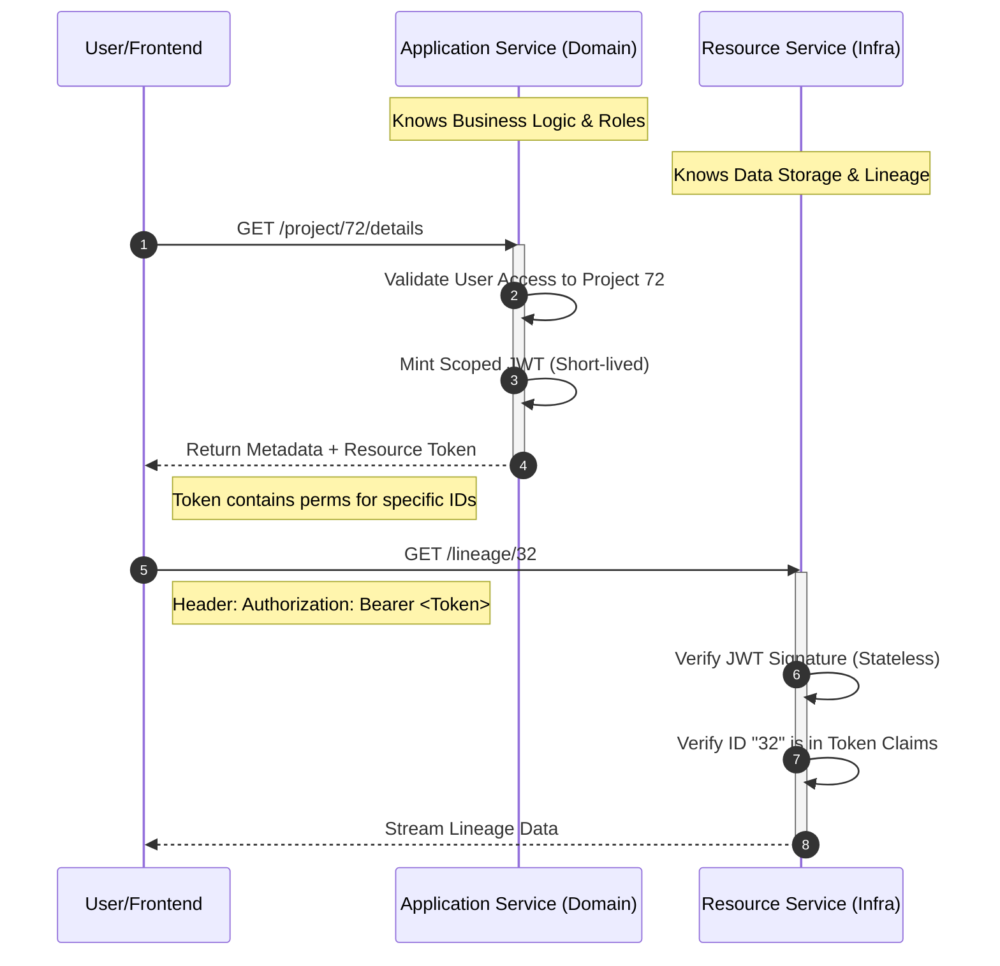

# Architectural Proposal: Pre-Signed Resource Authorization

## Executive Summary

This document outlines a solution for the **"Reusable Service Access Paradox."** In a microservices architecture, infrastructure services (Attachments, Lineage, Documents, etc.) often cannot determine access rights because they lack the domain context of the parent application.

By shifting authorization from the **Resource Service** to the **Application Service** using scoped, short-lived JWTs, we achieve full decoupling and high performance.

> **Note:** We are not reinventing the wheel. This pattern is conceptually identical to **OAuth 2.0 access tokens** (RFC 6749) with scoped claims — the same mechanism used by Google, GitHub, and every major API provider. What we propose here is a **lightweight simplification** of that standard, tailored specifically to authorize access to our shared internal components and resources, without the overhead of a full OAuth authorization server.

---

## 1. The Problem: The Lineage Paradox

Infrastructure services are designed to be **generic**. Access control, however, is usually **specific**:

| Issue | Description |
|---|---|
| **Circular Dependencies** | If the Attachment Service must call back to the Application Service to verify a user's rights, it creates tight coupling and high latency. |
| **The Lineage Gap** | A Lineage service tracks connections between items but cannot know the specific permission logic for every domain item it tracks. |
| **Domain Leakage** | Forcing infrastructure services to understand domain rules pollutes them with business logic they shouldn't own. |

---

## 2. The Solution: Pre-Signed Resource Tokens

Instead of the Resource Service asking *"Is this user allowed?"*, the **Application Service** (which owns the domain logic) issues a cryptographically signed **Permission Grant** (JWT) directly to the frontend.

The frontend then presents this token to the Resource Service, which only needs to verify the signature and check the requested ID against the token's scope.

### Analogy to OAuth 2.0

| OAuth 2.0 Concept | Our Equivalent |
|---|---|
| Authorization Server | Application Service |
| Resource Server | Resource Service (Lineage / Attachment / Document) |
| Access Token (JWT) | Pre-Signed Resource Token |
| `scope` claim | `perms` claim (with explicit IDs) |
| Client | Frontend / User Browser |

The key simplification: instead of generic scopes like `read:files`, we embed the **exact resource IDs** the user is allowed to touch. This makes verification a pure local check — no introspection endpoint required.

---

## 3. Request & Data Flow



---

## 4. Technical Implementation

### 4.1 JWT Payload Structure

The Application Service signs a token containing the specific resources the user is permitted to access within that session.

```json
{
  "iss": "application-svc",
  "sub": "user_123",
  "iat": 1713519000,
  "exp": 1713519300,
  "perms": {
    "lineage_ids": ["32", "45", "99"],
    "attachment_ids": ["att_001"],
    "actions": ["READ"]
  }
}
```

| Field | Purpose |
|---|---|
| `iss` | Issuer — identifies which Application Service minted the token. |
| `sub` | Subject — the user the token was issued for. |
| `iat` / `exp` | Issued-at / Expiry — bounds the token to a short window (5–10 min). |
| `perms` | The explicit resource scope: which IDs and which actions are allowed. |

### 4.2 Verification Logic

The Resource Service performs **two checks** on every request:

1. **Cryptographic Integrity** — Is the token signed by a trusted Application Service? (Validate signature against the issuer's public key.)
2. **Scope Validation** — Is the requested resource ID (e.g. `32`) present in the relevant `perms.*_ids` array?

Both checks are local CPU operations. No network calls, no database lookups.

---

## 5. Core Benefits

| Benefit | Description |
|---|---|
| **Performance** | Eliminates cross-service "permission check" calls. Verification is a local CPU task (cryptography). |
| **Decoupling** | The Resource Service stays "dumb" and infrastructure-focused; it never needs to understand domain-specific roles. |
| **Security** | Tokens are short-lived (5–10 min) and limited to specific resource IDs, minimizing the risk of token theft. |
| **Scalability** | As the number of domain services grows, the central Lineage / Document / Attachment service remains untouched. |
| **Familiarity** | Built on the same mental model as OAuth 2.0 — engineers already know the pattern. |

---

## 6. Trade-offs & Considerations

| Concern | Mitigation |
|---|---|
| **Token size grows with ID count** | Keep `perms` scoped to the current page/session, not the user's entire access set. |
| **Revocation is hard with stateless JWTs** | Keep expiry short (5–10 min). For high-risk actions, fall back to a revocation list or shorter TTL. |
| **Key rotation** | Use JWKS endpoints (standard OAuth 2.0 practice) so Resource Services can fetch and cache public keys. |
| **Action granularity** | Start with `READ` / `WRITE`; expand only when a real use case demands it. |

---

## 7. Status

- **Proposed by:** Robert
- **Status:** Architectural Draft for Review
- **Prior art:** OAuth 2.0 (RFC 6749), JWT (RFC 7519) — this proposal is a domain-specific simplification, not a new invention.
